# 🔧 Documentación Técnica - WooCommerce ELIT Connector

## 📋 Índice
1. [Diagramas de Arquitectura](#diagramas-de-arquitectura)
2. [Flujos de Datos](#flujos-de-datos)
3. [Ejemplos de Código](#ejemplos-de-código)
4. [Base de Datos](#base-de-datos)
5. [API Reference](#api-reference)
6. [Configuración Avanzada](#configuración-avanzada)
7. [Testing](#testing)
8. [Deployment](#deployment)

---

## 🏗️ Diagramas de Arquitectura

### Arquitectura General


### Flujo de Sincronización

```mermaid
sequenceDiagram
    participant U as Usuario
    participant P as Plugin
    participant E as ELIT API
    participant W as WooCommerce
    
    U->>P: Inicia sincronización
    P->>E: GET /productos/csv
    E-->>P: Datos CSV
    P->>P: Parsear CSV
    P->>P: Transformar datos
    P->>W: Crear/Actualizar productos
    W-->>P: IDs de productos
    P->>P: Procesar imágenes
    P->>W: Asignar imágenes
    P->>P: Actualizar metadatos
    P-->>U: Reporte de sincronización
```


---

## 🔄 Flujos de Datos

### 1. Inicialización del Plugin
```php
// woocommerce-elit-connector.php
define('VERSION_ELIT', '1.0.0');
define('PLUGIN_DIR', plugin_dir_path(__FILE__));

// Incluir archivos necesarios
require_once PLUGIN_DIR . 'includes/elit-api.php';
require_once PLUGIN_DIR . 'includes/product-sync.php';
require_once PLUGIN_DIR . 'includes/settings.php';
require_once PLUGIN_DIR . 'includes/admin-hooks.php';
require_once PLUGIN_DIR . 'includes/activation.php';
require_once PLUGIN_DIR . 'includes/elit-sync-callback.php';
require_once PLUGIN_DIR . 'includes/price-calculator.php';
require_once PLUGIN_DIR . 'includes/demo-mode.php';

// Registrar hooks
add_action('admin_menu', 'elit_menu');
add_action('admin_init', 'elit_register_settings');
add_action('elit_sync_products', 'elit_callback');
```

### 2. Proceso de Sincronización
```php
// includes/elit-sync-callback.php
function elit_callback() {
    // Configurar límites de ejecución
    ini_set('max_execution_time', 60);
    ini_set('memory_limit', '128M');
    
    $start_time = microtime(true);
    $time_limit = 30; // segundos
    
    // Obtener configuración
    $limit = 100;
    $offset = get_option('elit_sync_offset', 0);
    
    // Intentar API real primero
    $products = ELIT_API_Manager::get_products_batch($limit, $offset);
    
    // Fallback a modo demo si falla
    if (empty($products)) {
        $products = ELIT_Demo_API::get_products_batch($limit, $offset);
    }
    
    // Procesar productos
    $results = NB_Product_Sync::sync_products_from_api($products, false);
    
    // Actualizar offset
    update_option('elit_sync_offset', $offset + $limit);
    
    // Logging
    NB_Logger::info("Sincronización completada: " . json_encode($results));
}
```

### 3. Transformación de Datos
```php
// includes/elit-api.php
public static function transform_product_data($elit_product) {
    return array(
        // Campos principales usando mapeo configurable
        'sku' => self::get_mapped_field($elit_product, 'sku'),
        'name' => self::get_mapped_field($elit_product, 'name'),
        'price' => self::get_elit_price($elit_product),
        'stock_quantity' => self::get_mapped_field($elit_product, 'stock_quantity'),
        'stock_status' => self::get_elit_stock_status($elit_product),
        
        // Metadatos ELIT completos
        'meta_data' => array(
            'elit_id' => $elit_product['id'],
            'elit_codigo_alfa' => $elit_product['codigo_alfa'],
            'elit_pvp_usd' => $elit_product['pvp_usd'],
            'elit_pvp_ars' => $elit_product['pvp_ars'],
            // ... más metadatos
        )
    );
}
```

---

## 💻 Ejemplos de Código

### 1. Crear Producto en WooCommerce
```php
// includes/product-sync.php
private static function create_new_product($data) {
    $product = new WC_Product_Simple();
    
    // Configurar datos básicos
    $product->set_name($data['name']);
    $product->set_sku($data['sku']);
    $product->set_regular_price($data['price']);
    $product->set_manage_stock(true);
    $product->set_stock_quantity($data['stock_quantity']);
    $product->set_stock_status($data['stock_status']);
    
    // Configurar peso si está disponible
    if (!empty($data['weight'])) {
        $product->set_weight($data['weight']);
    }
    
    // Guardar producto
    $product_id = $product->save();
    
    if ($product_id) {
        // Asignar categorías
        self::set_product_categories($product_id, $data['categories']);
        
        // Procesar imágenes si está habilitado
        if (get_option('elit_update_images', true) && !empty($data['images'])) {
            self::set_product_images($product_id, $data['images']);
        }
        
        // Guardar metadatos ELIT
        if (!empty($data['meta_data'])) {
            foreach ($data['meta_data'] as $key => $value) {
                update_post_meta($product_id, $key, $value);
            }
        }
    }
    
    return $product_id;
}
```

### 2. Procesar Imágenes con Optimización
```php
// includes/product-sync.php
private static function set_product_images($product_id, $images) {
    $max_images = get_option('elit_max_images', 10);
    $gallery_ids = array();
    $processed_count = 0;
    
    foreach ($images as $index => $image_url) {
        if ($processed_count >= $max_images) break;
        
        // Verificar si imagen ya existe
        $existing_attachment = self::get_attachment_by_url($image_url);
        
        if ($existing_attachment) {
            $attachment_id = $existing_attachment;
        } else {
            // Descargar con timeout
            $attachment_id = self::download_image_with_timeout($image_url, $product_id);
        }
        
        if (!is_wp_error($attachment_id) && $attachment_id) {
            if ($index === 0) {
                set_post_thumbnail($product_id, $attachment_id);
            } else {
                $gallery_ids[] = $attachment_id;
            }
            $processed_count++;
        }
    }
    
    // Actualizar galería
    if (!empty($gallery_ids)) {
        update_post_meta($product_id, '_product_image_gallery', implode(',', $gallery_ids));
    }
}
```

### 3. Mapeo Configurable de Campos
```php
// includes/elit-api.php
private static function get_mapped_field($elit_product, $wc_field) {
    $elit_field = get_option('elit_field_' . $wc_field, '');
    
    if (empty($elit_field)) {
        // Mapeo por defecto
        $default_mappings = array(
            'sku' => 'codigo_producto',
            'name' => 'nombre',
            'stock_quantity' => 'stock_total',
            'weight' => 'peso',
            'brand' => 'marca',
            'warranty' => 'garantia',
            'ean' => 'ean',
            'gamer' => 'gamer',
            'attributes' => 'atributos'
        );
        
        $elit_field = isset($default_mappings[$wc_field]) ? $default_mappings[$wc_field] : '';
    }
    
    return isset($elit_product[$elit_field]) ? $elit_product[$elit_field] : '';
}
```

### 4. Manejo de Precios con Markup
```php
// includes/elit-api.php
public static function get_elit_price($elit_product) {
    $apply_markup = get_option('elit_apply_markup_on_pvp', false);
    $markup_percentage = get_option('elit_markup_percentage', 0);
    $sync_usd = get_option('elit_sync_usd', false);
    
    if ($sync_usd) {
        $price = self::get_field_value($elit_product, array('pvp_usd'), 0);
    } else {
        $price = self::get_field_value($elit_product, array('pvp_ars'), 0);
    }
    
    if ($apply_markup && $markup_percentage > 0) {
        $price = $price * (1 + ($markup_percentage / 100));
    }
    
    return floatval($price);
}
```

---

## 🗄️ Base de Datos

### Tablas de WordPress Utilizadas
```sql
-- Productos de WooCommerce
wp_posts (post_type = 'product')
wp_postmeta (metadatos del producto)
wp_term_relationships (categorías)
wp_term_taxonomy (taxonomías)
wp_terms (términos)

-- Opciones del plugin
wp_options (opciones de configuración)
```

### Metadatos ELIT Almacenados
```php
$elit_meta_fields = array(
    'elit_id' => 'ID único ELIT',
    'elit_codigo_alfa' => 'Código alfanumérico',
    'elit_codigo_producto' => 'Código de producto',
    'elit_categoria' => 'Categoría ELIT',
    'elit_sub_categoria' => 'Subcategoría ELIT',
    'elit_marca' => 'Marca ELIT',
    'elit_precio' => 'Precio base ELIT',
    'elit_pvp_usd' => 'PVP en dólares',
    'elit_pvp_ars' => 'PVP en pesos',
    'elit_peso' => 'Peso del producto',
    'elit_ean' => 'Código EAN',
    'elit_nivel_stock' => 'Nivel de stock',
    'elit_stock_total' => 'Stock total',
    'elit_garantia' => 'Información de garantía',
    'elit_link' => 'Enlace ELIT',
    'elit_gamer' => 'Producto gaming',
    'elit_creado' => 'Fecha de creación',
    'elit_actualizado' => 'Fecha de actualización'
);
```

### Consultas SQL Útiles
```sql
-- Buscar productos ELIT por SKU
SELECT p.ID, p.post_title, pm.meta_value as sku
FROM wp_posts p
JOIN wp_postmeta pm ON p.ID = pm.post_id
WHERE p.post_type = 'product'
AND pm.meta_key = '_sku'
AND pm.meta_value LIKE 'ELIT-%';

-- Contar productos sincronizados
SELECT COUNT(*) as total_products
FROM wp_posts p
JOIN wp_postmeta pm ON p.ID = pm.post_id
WHERE p.post_type = 'product'
AND pm.meta_key = 'elit_id'
AND pm.meta_value IS NOT NULL;

-- Productos con stock bajo
SELECT p.ID, p.post_title, pm.meta_value as stock
FROM wp_posts p
JOIN wp_postmeta pm ON p.ID = pm.post_id
WHERE p.post_type = 'product'
AND pm.meta_key = '_stock'
AND CAST(pm.meta_value AS UNSIGNED) < 10;
```

---

## 🔌 API Reference

### ELIT_API_Manager
```php
class ELIT_API_Manager {
    // Propiedades estáticas
    private static $api_url = 'https://clientes.elit.com.ar/v1/api/productos';
    private static $csv_api_url = 'https://clientes.elit.com.ar/v1/api/productos/csv';
    private static $max_limit = 100;
    
    // Métodos públicos
    public static function get_products_batch($limit, $offset)
    public static function transform_product_data($elit_product)
    public static function test_connection()
    public static function get_elit_price($elit_product)
    public static function get_elit_images($elit_product)
    public static function get_elit_stock($elit_product)
    public static function get_elit_stock_status($elit_product)
    public static function get_elit_categories($elit_product)
    public static function parse_csv_products($csv_data)
    
    // Métodos privados
    private static function make_request($url, $data = null)
    private static function get_field_value($data, $field_names, $default = '')
    private static function get_mapped_field($elit_product, $wc_field)
    private static function process_image_url($url)
}
```

### NB_Product_Sync
```php
class NB_Product_Sync {
    // Propiedades estáticas
    private static $max_execution_time = 45;
    private static $batch_size = 5;
    
    // Métodos públicos
    public static function sync_products_from_api($api_data, $sync_descriptions = false)
    public static function delete_products_not_in_api($api_skus)
    
    // Métodos privados
    private static function process_single_product($product_data, $sync_descriptions = false)
    private static function create_new_product($data)
    private static function update_existing_product($product_id, $data, $sync_descriptions = false)
    private static function set_product_images($product_id, $images)
    private static function set_product_categories($product_id, $categories)
    private static function update_product_metadata($product_id, $data)
    private static function get_attachment_by_url($image_url)
    private static function download_image_with_timeout($image_url, $product_id)
    private static function cleanup_duplicate_images($product_id)
}
```

### Funciones de Utilidad
```php
// includes/price-calculator.php
function nb_calculate_price_with_markup($base_price, $markup_percentage)
function nb_get_markup_percentage()

// includes/elit-sync-callback.php
function elit_callback()

// includes/settings.php
function elit_options_page()
function elit_test_credentials_ajax()
function elit_save_test_credentials_ajax()

// includes/admin-hooks.php
function elit_register_settings()
function elit_menu()
function elit_plugin_action_links($links)
```

---

## ⚙️ Configuración Avanzada

### Variables de Entorno
```php
// wp-config.php
define('ELIT_DEBUG', true);
define('ELIT_MAX_EXECUTION_TIME', 120);
define('ELIT_MEMORY_LIMIT', '256M');
define('ELIT_BATCH_SIZE', 10);
define('ELIT_MAX_IMAGES', 15);
```

### Hooks Personalizados
```php
// Filtrar datos de producto antes de guardar
add_filter('elit_product_data', function($data, $elit_product) {
    // Modificar datos si es necesario
    return $data;
}, 10, 2);

// Filtrar precio antes de aplicar markup
add_filter('elit_price_before_markup', function($price, $elit_product) {
    // Lógica personalizada de precios
    return $price;
}, 10, 2);

// Filtrar imágenes antes de procesar
add_filter('elit_images_before_process', function($images, $elit_product) {
    // Filtrar o modificar imágenes
    return $images;
}, 10, 2);
```

### Configuración de Servidor
```apache
# .htaccess
# Aumentar límites para sincronización
php_value max_execution_time 300
php_value memory_limit 256M
php_value upload_max_filesize 64M
php_value post_max_size 64M
```

---

## 🧪 Testing

### Tests Unitarios
```php
// test-elit-api.php
class Test_ELIT_API extends WP_UnitTestCase {
    public function test_get_products_batch() {
        $products = ELIT_API_Manager::get_products_batch(10, 0);
        $this->assertIsArray($products);
        $this->assertLessThanOrEqual(10, count($products));
    }
    
    public function test_transform_product_data() {
        $elit_product = array(
            'id' => '123',
            'nombre' => 'Test Product',
            'codigo_producto' => 'TEST-001',
            'pvp_ars' => 1000
        );
        
        $transformed = ELIT_API_Manager::transform_product_data($elit_product);
        $this->assertEquals('TEST-001', $transformed['sku']);
        $this->assertEquals('Test Product', $transformed['name']);
    }
}
```

### Tests de Integración
```php
// test-sync-integration.php
class Test_Sync_Integration extends WP_UnitTestCase {
    public function test_full_sync_process() {
        // Simular datos de API
        $api_data = array(
            array(
                'id' => '123',
                'nombre' => 'Test Product',
                'codigo_producto' => 'TEST-001',
                'pvp_ars' => 1000,
                'stock_total' => 10
            )
        );
        
        // Ejecutar sincronización
        $results = NB_Product_Sync::sync_products_from_api($api_data);
        
        // Verificar resultados
        $this->assertArrayHasKey('created', $results);
        $this->assertEquals(1, $results['created']);
    }
}
```

### Tests de Rendimiento
```php
// test-performance.php
class Test_Performance extends WP_UnitTestCase {
    public function test_sync_performance() {
        $start_time = microtime(true);
        
        // Ejecutar sincronización con 100 productos
        $api_data = $this->generate_test_products(100);
        NB_Product_Sync::sync_products_from_api($api_data);
        
        $execution_time = microtime(true) - $start_time;
        
        // Verificar que no exceda 60 segundos
        $this->assertLessThan(60, $execution_time);
    }
}
```

---

## 🚀 Deployment

### Checklist de Deployment
- [ ] Verificar compatibilidad de PHP (7.4+)
- [ ] Verificar compatibilidad de WordPress (5.0+)
- [ ] Verificar compatibilidad de WooCommerce (3.0+)
- [ ] Probar en entorno de staging
- [ ] Verificar credenciales de API
- [ ] Configurar límites de servidor
- [ ] Habilitar logging de debug
- [ ] Probar sincronización completa
- [ ] Verificar imágenes se descargan correctamente
- [ ] Verificar metadatos se guardan correctamente

### Script de Deployment
```bash
#!/bin/bash
# deploy.sh

echo "🚀 Iniciando deployment de WooCommerce ELIT Connector..."

# Verificar requisitos
php -v | grep -q "7.4" || { echo "❌ PHP 7.4+ requerido"; exit 1; }

# Backup de base de datos
wp db export backup-$(date +%Y%m%d-%H%M%S).sql

# Activar plugin
wp plugin activate woocommerce-elit-connector

# Configurar opciones por defecto
wp option update elit_user_id "14679"
wp option update elit_token "4ou95wmie1q"
wp option update elit_sku_prefix "ELIT-"

# Probar conexión
wp eval "ELIT_API_Manager::test_connection();"

echo "✅ Deployment completado"
```

### Monitoreo Post-Deployment
```php
// includes/monitoring.php
class ELIT_Monitoring {
    public static function check_sync_health() {
        $last_sync = get_option('elit_last_sync');
        $sync_interval = get_option('elit_sync_interval', 'daily');
        
        $expected_interval = strtotime('-' . $sync_interval);
        
        if ($last_sync < $expected_interval) {
            // Enviar alerta de sincronización retrasada
            self::send_alert('Sync retrasada', 'La sincronización no se ha ejecutado en el intervalo esperado');
        }
    }
    
    public static function check_api_health() {
        $connection = ELIT_API_Manager::test_connection();
        
        if (!$connection) {
            // Enviar alerta de API no disponible
            self::send_alert('API no disponible', 'No se puede conectar con la API de ELIT');
        }
    }
}
```

---

## 📊 Métricas y Monitoreo

### Dashboard de Métricas
```php
// includes/metrics.php
class ELIT_Metrics {
    public static function get_sync_stats() {
        return array(
            'total_products' => self::count_elit_products(),
            'last_sync' => get_option('elit_last_sync'),
            'sync_duration' => get_option('elit_last_sync_duration'),
            'api_errors' => get_option('elit_api_errors', 0),
            'image_errors' => get_option('elit_image_errors', 0)
        );
    }
    
    public static function count_elit_products() {
        global $wpdb;
        
        return $wpdb->get_var("
            SELECT COUNT(*) 
            FROM {$wpdb->postmeta} pm
            JOIN {$wpdb->posts} p ON pm.post_id = p.ID
            WHERE pm.meta_key = 'elit_id'
            AND p.post_type = 'product'
            AND p.post_status = 'publish'
        ");
    }
}
```

### Logs Estructurados
```php
// includes/logger.php
class ELIT_Logger {
    public static function log_sync_event($event, $data = array()) {
        $log_entry = array(
            'timestamp' => current_time('mysql'),
            'event' => $event,
            'data' => $data,
            'memory_usage' => memory_get_usage(true),
            'execution_time' => microtime(true) - $_SERVER['REQUEST_TIME_FLOAT']
        );
        
        error_log('ELIT_SYNC: ' . json_encode($log_entry));
    }
}
```

---

**Última actualización**: Enero 2025  
**Versión**: 1.0.0  
**Autor**: [Tu nombre]  
**Licencia**: GPL v2 o superior
