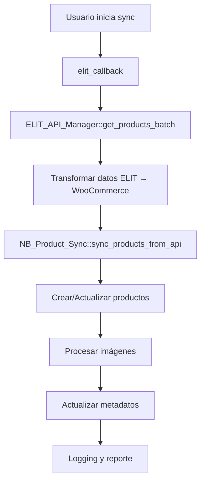

# 📚 Manual del Desarrollador - WooCommerce ELIT Connector

## 📋 Índice
1. [Descripción General](#descripción-general)
2. [Arquitectura del Plugin](#arquitectura-del-plugin)
3. [Estructura de Archivos](#estructura-de-archivos)
4. [Configuración y Opciones](#configuración-y-opciones)
5. [API de ELIT](#api-de-elit)
6. [Sincronización de Productos](#sincronización-de-productos)
7. [Mapeo de Campos](#mapeo-de-campos)
8. [Manejo de Imágenes](#manejo-de-imágenes)
9. [Sistema de Logging](#sistema-de-logging)
10. [Hooks y Filtros](#hooks-y-filtros)
11. [Troubleshooting](#troubleshooting)
12. [Desarrollo y Contribución](#desarrollo-y-contribución)

---

## 🎯 Descripción General

**WooCommerce ELIT Connector** es un plugin de WordPress que sincroniza productos desde la API de ELIT hacia WooCommerce. Permite configurar mapeo de campos, actualización selectiva y manejo inteligente de imágenes.

### Características Principales:
- ✅ Sincronización automática con API ELIT
- ✅ Mapeo configurable de campos
- ✅ Actualización selectiva (precios, stock, imágenes)
- ✅ Compatibilidad con imágenes .webp
- ✅ Modo demo para testing
- ✅ Logging detallado
- ✅ Control de límites de API (100 productos/request)

---

## 🏗️ Arquitectura del Plugin

### Patrón de Diseño
El plugin utiliza un patrón **Modular** con separación de responsabilidades:

```
woocommerce-elit-connector.php (Main)
├── includes/
│   ├── elit-api.php           (API Manager)
│   ├── product-sync.php       (Product Sync)
│   ├── settings.php           (Admin Interface)
│   ├── admin-hooks.php        (WordPress Hooks)
│   ├── activation.php         (Activation/Deactivation)
│   ├── elit-sync-callback.php (Sync Logic)
│   ├── price-calculator.php   (Price Calculations)
│   └── demo-mode.php          (Demo Data)
```

### Flujo de Sincronización


---

## 📁 Estructura de Archivos

### Archivo Principal
**`woocommerce-elit-connector.php`**
- Define constantes del plugin
- Incluye archivos necesarios
- Registra hooks de WordPress
- Maneja activación/desactivación

### Módulos Principales

#### 1. **`includes/elit-api.php`** - Gestor de API
```php
class ELIT_API_Manager {
    // Constantes de API
    private static $api_url = 'https://clientes.elit.com.ar/v1/api/productos';
    private static $csv_api_url = 'https://clientes.elit.com.ar/v1/api/productos/csv';
    private static $max_limit = 100;
    
    // Métodos principales
    public static function get_products_batch($limit, $offset)
    public static function transform_product_data($elit_product)
    public static function test_connection()
    public static function get_elit_price($elit_product)
    public static function get_elit_images($elit_product)
}
```

#### 2. **`includes/product-sync.php`** - Sincronización
```php
class NB_Product_Sync {
    // Configuración de rendimiento
    private static $max_execution_time = 45;
    private static $batch_size = 5;
    
    // Métodos principales
    public static function sync_products_from_api($api_data, $sync_descriptions)
    public static function create_new_product($data)
    public static function update_existing_product($product_id, $data)
    public static function set_product_images($product_id, $images)
}
```

#### 3. **`includes/settings.php`** - Interfaz de Administración
- Formularios de configuración
- Mapeo de campos ELIT → WooCommerce
- Configuración de actualización selectiva
- Botones de sincronización y testing

#### 4. **`includes/elit-sync-callback.php`** - Lógica de Sincronización
```php
function elit_callback() {
    // Lógica principal de sincronización
    // Manejo de lotes de 100 productos
    // Control de tiempo de ejecución
    // Fallback a modo demo
}
```

---

## ⚙️ Configuración y Opciones

### Opciones de Base de Datos
```php
// Credenciales ELIT
'elit_user_id'           // ID de usuario ELIT
'elit_token'             // Token de autenticación
'elit_sku_prefix'        // Prefijo para SKUs
'elit_sync_usd'          // Sincronizar precios en USD
'elit_description'       // Descripción del plugin
'elit_sync_interval'     // Intervalo de sincronización
'elit_markup_percentage' // Porcentaje de markup
'elit_apply_markup_on_pvp' // Aplicar markup sobre PVP

// Mapeo de campos
'elit_field_sku'         // Campo ELIT para SKU
'elit_field_name'        // Campo ELIT para nombre
'elit_field_price'       // Campo ELIT para precio
// ... (17 campos mapeables)

// Configuración de actualización
'elit_update_prices'     // Actualizar precios
'elit_update_stock'      // Actualizar stock
'elit_update_images'     // Actualizar imágenes
'elit_max_images'        // Máximo de imágenes por producto
'elit_cleanup_duplicate_images' // Limpiar duplicados
'elit_update_categories' // Actualizar categorías
'elit_update_metadata'   // Actualizar metadatos
```

### Configuración por Defecto
```php
// En includes/activation.php
$default_options = array(
    'elit_user_id' => '14679',
    'elit_token' => '4ou95wmie1q',
    'elit_sku_prefix' => 'ELIT-',
    'elit_sync_usd' => false,
    'elit_description' => 'Producto sincronizado desde ELIT',
    'elit_sync_interval' => 'daily',
    'elit_markup_percentage' => 0,
    'elit_apply_markup_on_pvp' => false,
    'elit_update_prices' => true,
    'elit_update_stock' => true,
    'elit_update_images' => true,
    'elit_max_images' => 10,
    'elit_cleanup_duplicate_images' => false,
    'elit_update_categories' => true,
    'elit_update_metadata' => true
);
```

---

## 🔌 API de ELIT

### Endpoints Utilizados
1. **CSV Endpoint** (Principal)
   ```
   GET https://clientes.elit.com.ar/v1/api/productos/csv?user_id={user_id}&token={token}
   ```

2. **JSON Endpoint** (Fallback)
   ```
   POST https://clientes.elit.com.ar/v1/api/productos?limit=100
   Body: {"user_id": "14679", "token": "4ou95wmie1q"}
   ```

### Campos de Respuesta ELIT
```php
$elit_fields = array(
    'id' => 'ID único',
    'codigo_alfa' => 'Código alfanumérico',
    'codigo_producto' => 'Código de producto',
    'nombre' => 'Nombre',
    'categoria' => 'Categoría',
    'sub_categoria' => 'Subcategoría',
    'marca' => 'Marca',
    'precio' => 'Precio base',
    'impuesto_interno' => 'Impuesto interno',
    'iva' => 'IVA',
    'moneda' => 'Moneda',
    'markup' => 'Markup',
    'cotizacion' => 'Cotización',
    'pvp_usd' => 'PVP USD',
    'pvp_ars' => 'PVP ARS',
    'peso' => 'Peso',
    'ean' => 'EAN',
    'nivel_stock' => 'Nivel de stock',
    'stock_total' => 'Stock total',
    'stock_deposito_cliente' => 'Stock depósito cliente',
    'stock_deposito_cd' => 'Stock depósito CD',
    'garantia' => 'Garantía',
    'link' => 'Enlace',
    'imagenes' => 'Imágenes',
    'miniaturas' => 'Miniaturas',
    'atributos' => 'Atributos',
    'gamer' => 'Gaming',
    'creado' => 'Fecha creación',
    'actualizado' => 'Fecha actualización'
);
```

### Manejo de Errores de API
```php
// En ELIT_API_Manager::make_request()
if (is_wp_error($response)) {
    NB_Logger::error('Error de conexión: ' . $response->get_error_message());
    return null;
}

$response_code = wp_remote_retrieve_response_code($response);
if ($response_code !== 200) {
    NB_Logger::error("Error HTTP: {$response_code}");
    return null;
}
```

---

## 🔄 Sincronización de Productos

### Proceso de Sincronización
1. **Inicio**: Usuario hace clic en "Actualizar todos"
2. **Fetch**: Obtener productos de ELIT (lotes de 100)
3. **Transform**: Convertir datos ELIT → WooCommerce
4. **Sync**: Crear/actualizar productos en WooCommerce
5. **Images**: Procesar imágenes si está habilitado
6. **Metadata**: Actualizar metadatos ELIT
7. **Report**: Generar reporte de sincronización

### Control de Rendimiento
```php
// Límites de ejecución
ini_set('max_execution_time', 60);
ini_set('memory_limit', '128M');

// Control de tiempo en sincronización
$start_time = microtime(true);
$time_limit = 30; // segundos

if ((microtime(true) - $start_time) > $time_limit) {
    NB_Logger::warning('Tiempo de ejecución excedido, deteniendo');
    break;
}
```

### Manejo de Lotes
```php
// Procesamiento por lotes de 100 productos
$limit = 100;
$offset = get_option('elit_sync_offset', 0);

$products = ELIT_API_Manager::get_products_batch($limit, $offset);

// Actualizar offset para siguiente ejecución
update_option('elit_sync_offset', $offset + $limit);
```

---

## 🗺️ Mapeo de Campos

### Sistema de Mapeo Configurable
```php
// En includes/elit-api.php
private static function get_mapped_field($elit_product, $wc_field) {
    $elit_field = get_option('elit_field_' . $wc_field, '');
    
    if (empty($elit_field)) {
        // Mapeo por defecto
        $default_mappings = array(
            'sku' => 'codigo_producto',
            'name' => 'nombre',
            'stock_quantity' => 'stock_total',
            'weight' => 'peso',
            'brand' => 'marca',
            'warranty' => 'garantia',
            'ean' => 'ean',
            'gamer' => 'gamer',
            'attributes' => 'atributos'
        );
        
        $elit_field = isset($default_mappings[$wc_field]) ? $default_mappings[$wc_field] : '';
    }
    
    return isset($elit_product[$elit_field]) ? $elit_product[$elit_field] : '';
}
```

### Campos Mapeables
| Campo WooCommerce | Campo ELIT (Default) | Descripción |
|-------------------|---------------------|-------------|
| sku | codigo_producto | SKU del producto |
| name | nombre | Nombre del producto |
| price | pvp_ars | Precio en pesos |
| price_usd | pvp_usd | Precio en dólares |
| stock_quantity | stock_total | Cantidad de stock |
| stock_status | nivel_stock | Estado de stock |
| weight | peso | Peso del producto |
| ean | ean | Código de barras |
| warranty | garantia | Información de garantía |
| gamer | gamer | Producto gaming |
| category | categoria | Categoría principal |
| subcategory | sub_categoria | Subcategoría |
| brand | marca | Marca del producto |
| images | imagenes | Imágenes del producto |
| thumbnails | miniaturas | Miniaturas |
| attributes | atributos | Atributos del producto |
| link | link | Enlace ELIT |

---

## 🖼️ Manejo de Imágenes

### Proceso de Imágenes
1. **Verificación**: Comprobar si imagen ya existe
2. **Descarga**: Descargar con timeout de 10 segundos
3. **Procesamiento**: Convertir a attachment de WordPress
4. **Asignación**: Primera imagen como featured, resto en galería
5. **Limpieza**: Eliminar duplicados si está habilitado

### Configuración de Imágenes
```php
// Límite de imágenes por producto
$max_images = get_option('elit_max_images', 10);

// Timeout para descargas
add_filter('http_request_timeout', function() { return 10; });

// Verificación de duplicados
$existing_attachment = self::get_attachment_by_url($image_url);
```

### Compatibilidad .webp
```php
// En ELIT_API_Manager::process_image_url()
private static function process_image_url($url) {
    if (empty($url)) return '';
    
    // Asegurar compatibilidad con .webp
    if (strpos($url, '.webp') !== false) {
        return $url;
    }
    
    return $url;
}
```

---

## 📝 Sistema de Logging

### Clase NB_Logger
```php
class NB_Logger {
    public static function info($message)
    public static function warning($message)
    public static function error($message)
    public static function debug($message)
}
```

### Niveles de Log
- **INFO**: Operaciones exitosas, estadísticas
- **WARNING**: Problemas menores, timeouts
- **ERROR**: Errores críticos, fallos de API
- **DEBUG**: Información detallada para desarrollo

### Ubicación de Logs
Los logs se guardan en:
- WordPress Debug Log (si está habilitado)
- Archivo de log del plugin (si está configurado)

---

## 🎣 Hooks y Filtros

### Hooks de WordPress
```php
// Activación/Desactivación
register_activation_hook(__FILE__, 'elit_activation');
register_deactivation_hook(__FILE__, 'elit_deactivation');

// Menú de administración
add_action('admin_menu', 'elit_menu');
add_action('admin_init', 'elit_register_settings');

// Sincronización programada
add_action('elit_sync_products', 'elit_callback');
```

### Filtros Personalizados
```php
// Filtrar datos de producto antes de guardar
apply_filters('elit_product_data', $transformed, $elit_product);

// Filtrar precio antes de aplicar markup
apply_filters('elit_price_before_markup', $price, $elit_product);

// Filtrar imágenes antes de procesar
apply_filters('elit_images_before_process', $images, $elit_product);
```

---

## 🔧 Troubleshooting

### Errores Comunes

#### 1. **Error de Conexión API**
```
Síntoma: "No se encontraron productos en ELIT API"
Solución: 
- Verificar credenciales en configuración
- Probar conexión con botón "Test Credentials"
- Verificar que el endpoint CSV esté disponible
```

#### 2. **Timeout de Ejecución**
```
Síntoma: "max_execution_time exceeded"
Solución:
- Reducir batch_size en product-sync.php
- Reducir max_images en configuración
- Aumentar max_execution_time en servidor
```

#### 3. **Imágenes No Se Descargan**
```
Síntoma: Productos sin imágenes
Solución:
- Verificar que "Actualizar Imágenes" esté habilitado
- Comprobar URLs de imágenes en datos ELIT
- Verificar permisos de escritura en uploads/
```

#### 4. **Productos Duplicados**
```
Síntoma: Múltiples productos con mismo SKU
Solución:
- Verificar mapeo de campo SKU
- Comprobar prefijo de SKU
- Revisar lógica de búsqueda de productos existentes
```

### Debugging
```php
// Habilitar debug en wp-config.php
define('WP_DEBUG', true);
define('WP_DEBUG_LOG', true);

// Ver logs en tiempo real
tail -f /path/to/wp-content/debug.log | grep "ELIT"
```

---

## 🚀 Desarrollo y Contribución

### Estructura para Nuevas Funcionalidades
1. **Crear función** en archivo apropiado
2. **Agregar opciones** en `admin-hooks.php`
3. **Crear interfaz** en `settings.php`
4. **Documentar** en este manual
5. **Probar** con datos reales
6. **Commit** con mensaje descriptivo

### Convenciones de Código
```php
// Nombres de funciones: snake_case
function elit_sync_products() {}

// Nombres de clases: PascalCase
class ELIT_API_Manager {}

// Nombres de variables: snake_case
$product_data = array();

// Comentarios: Formato PHPDoc
/**
 * Sync products from ELIT API
 * 
 * @since 1.0.0
 * @param array $api_data Product data from API
 * @return array Results array
 */
```

### Testing
```php
// Probar conexión API
ELIT_API_Manager::test_connection();

// Probar sincronización con datos demo
ELIT_Demo_API::get_products_batch(5, 0);

// Verificar configuración
$options = get_option('elit_options');
var_dump($options);
```

### Git Workflow
```bash
# Crear rama para nueva funcionalidad
git checkout -b feature/nueva-funcionalidad

# Hacer cambios y commit
git add .
git commit -m "✨ Nueva funcionalidad: descripción"

# Push y crear PR
git push origin feature/nueva-funcionalidad
```

---

## 📊 Monitoreo y Métricas

### Métricas Importantes
- **Productos sincronizados**: Contador en cada sync
- **Tiempo de ejecución**: Duración de sincronización
- **Errores de API**: Frecuencia y tipo
- **Imágenes procesadas**: Cantidad y éxito
- **Memoria utilizada**: Uso de recursos

### Dashboard de Estado
```php
// En settings.php - mostrar estadísticas
$sync_stats = get_option('elit_sync_stats', array());
echo "Última sincronización: " . $sync_stats['last_sync'];
echo "Productos sincronizados: " . $sync_stats['products_synced'];
echo "Tiempo de ejecución: " . $sync_stats['execution_time'];
```

---

## 🔒 Seguridad

### Validación de Datos
```php
// Sanitizar inputs
$user_id = sanitize_text_field($_POST['elit_user_id']);
$token = sanitize_text_field($_POST['elit_token']);

// Validar URLs
$image_url = esc_url_raw($image_url);

// Verificar nonces
if (!wp_verify_nonce($_POST['_wpnonce'], 'elit_settings')) {
    wp_die('Nonce verification failed');
}
```

### Permisos
```php
// Verificar permisos de administrador
if (!current_user_can('manage_options')) {
    wp_die('Insufficient permissions');
}
```

---

## 📚 Recursos Adicionales

### Documentación ELIT
- [API Documentation](https://clientes.elit.com.ar/v1/api/productos)
- [CSV Endpoint](https://clientes.elit.com.ar/v1/api/productos/csv)

### WordPress Resources
- [Plugin API](https://developer.wordpress.org/plugins/)
- [WooCommerce API](https://woocommerce.github.io/woocommerce-rest-api-docs/)
- [WordPress Coding Standards](https://developer.wordpress.org/coding-standards/)

### Archivos de Configuración
- `wp-config.php`: Configuración de debug
- `.htaccess`: Reglas de servidor
- `php.ini`: Configuración de PHP

---

## 📞 Soporte

### Contacto
- **Desarrollador**: [Tu nombre]
- **Email**: [tu-email@ejemplo.com]
- **GitHub**: [tu-usuario/woocommerce-elit-connector]

### Reportar Bugs
1. Verificar que no esté en la lista de errores conocidos
2. Revisar logs de debug
3. Crear issue en GitHub con:
   - Descripción del problema
   - Pasos para reproducir
   - Logs relevantes
   - Versión de WordPress/PHP

### Solicitar Funcionalidades
1. Crear issue con etiqueta "enhancement"
2. Describir la funcionalidad deseada
3. Explicar el caso de uso
4. Proporcionar ejemplos si es posible

---

**Última actualización**: Enero 2025  
**Versión del manual**: 1.0.0  
**Compatibilidad**: WordPress 5.0+, WooCommerce 3.0+, PHP 7.4+
